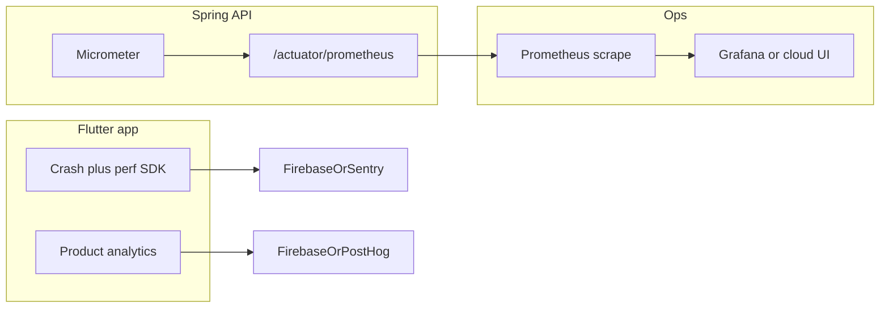

# Monitoring app performance and user behavior

Plan for observability and product analytics, aligned with the current codebase (Spring Boot + Flutter + Firebase for push).

## Current state

### Backend (strong baseline)

The API already uses Spring Boot Actuator, Micrometer, and the Prometheus registry (`server/build.gradle`, `server/src/main/resources/application.yml`). Custom meters cover WebSocket sessions, place-list writes, match evaluation time, and API errors; `docs/runbooks/SLO_BASELINE.md` documents p95 targets and example PromQL.

### Gaps

- **Staging:** `deploy/staging/docker-compose.yml` has no Prometheus or Grafana service—`/actuator/prometheus` is available on the API container but nothing scrapes it yet.
- **Security:** `SecurityConfig` permits `/actuator/health` and `/actuator/info` explicitly; other actuator paths fall through to `permitAll()`, so metrics endpoints may be reachable on the same port as the API unless restricted by Caddy or a separate management port (see TODO in `application.yml`).
- **Mobile:** `mobile/pubspec.yaml` only includes `firebase_core` and `firebase_messaging`. `PushBootstrap` initializes Firebase when push is enabled. There is no crash reporting, app performance traces, or product analytics SDK yet. iOS `GoogleService-Info.plist` still has placeholder keys and `IS_ANALYTICS_ENABLED` false.
- **Product intent:** `docs/PRD.md` §9 lists activation, core action, retention, and technical metrics—not yet implemented in the client.

## Recommended stack

| Layer | Recommendation | Rationale |
|-------|----------------|------------|
| **API performance / SLOs** | Keep Micrometer + Prometheus; add scraper + dashboards when ready | Already implemented; `docs/runbooks/SLO_BASELINE.md` is the source of truth. |
| **Mobile stability + perf** | **Firebase Crashlytics** + **Firebase Performance Monitoring** | Same Firebase project as FCM; fewer vendors. Alternative: **Sentry** for Flutter (and optionally Java) for one pane across mobile + server. |
| **User behavior / funnels** | **Firebase Analytics (GA4)** behind a thin Dart wrapper | Works with existing Firebase wiring; events map to PRD activation/retention. Alternative: PostHog/Mixpanel if richer product analytics are needed later—the wrapper keeps swapping feasible. |

## Phase 1 — Operationalize backend metrics

1. **Production hygiene:** Implement the documented approach—`management.server.port` (or API gateway rules) plus firewall/Caddy so `/actuator/metrics` and `/actuator/prometheus` are not public on the main API hostname. Tighten Spring Security if anything besides health/info should stay on the public port.
2. **Staging observability (optional but valuable):** Add a **Prometheus** service (and optionally **Grafana**) to staging compose, scrape the API’s Prometheus endpoint on the **internal Docker network** only (not published to the internet). Document the staging URL and example dashboards in the server README or runbooks.
3. **Alerting (later):** Define a minimal alert set from existing metrics (5xx rate, WS gauge collapse, match timer regression)—follow `docs/runbooks/INCIDENT_RESPONSE.md` patterns.

## Phase 2 — Mobile performance and reliability

1. **Dependencies:** Add `firebase_crashlytics` and `firebase_performance` (align versions with existing `firebase_core` / `firebase_messaging`, e.g. Firebase BoM if used).
2. **Initialization:** Run Crashlytics + Performance after `WidgetsFlutterBinding.ensureInitialized()` (and after `Firebase.initializeApp()` when Firebase is used—same pattern as `PushBootstrap`); handle non-Firebase dev builds if some flavors run without `google-services` (catch and log, or no-op).
3. **Signals:** Enable automatic crash collection; use Performance for HTTP (Dio) and custom traces for heavy flows (e.g. WebSocket connect, first map frame) where it helps answer client-side SLO questions in `SLO_BASELINE.md`.
4. **Release health:** Ensure version/build are visible in the Firebase console (standard Flutter/Android/iOS config).

## Phase 3 — User behavior (product analytics)

1. **Event catalog (short doc):** Name 8–15 events and required properties, mapped to `docs/PRD.md` §9—e.g. `auth_completed`, `home_reached` (activation), `place_watch_saved` / `broadcast_saved`, `subscription_checkout_started`, plus screen views derived from routes.
2. **Wrapper:** Add a small `Analytics` interface + Firebase implementation so calls look like `analytics.logEvent(name, params)` and vendors can be swapped later.
3. **Navigation:** Use `GoRouter`’s observer (or `RouteObserver`) in `mobile/lib/app/router.dart` for automatic screen logging with stable route names (`/splash`, `/auth/phone`, `/home`, …).
4. **Identity:** Set user id (or anonymized id) after successful auth; clear on logout—coordinate with `auth_state` / sign-out flow.
5. **Environments:** Use Firebase DebugView for dev; separate staging vs production projects or use GA4 filters so test data does not pollute production funnels.

## Phase 4 — Privacy and policy

1. **Consent:** If shipping in GDPR/CCPA regions, add an in-app consent flow before non-essential analytics; keep Crashlytics vs analytics toggles consistent with the privacy policy.
2. **iOS:** Review App Tracking Transparency (ATT) requirements for the chosen analytics stack; Firebase Analytics may still need disclosure strings in Info.plist depending on configuration.
3. **Documentation:** Brief section in `mobile/README.md` on what is collected and how to disable for local dev.

## Deferred

- **Full OpenTelemetry on the JVM** — only if distributed traces across many services are needed; Micrometer + logs + mobile RUM may suffice for v1.
- **Warehouse / BigQuery export** — valuable later for joining server events with client events; not required to start measuring.

## Success criteria

- Ops can see **p95 latency and error budgets** for key endpoints (existing metrics + optional Prometheus/Grafana).
- Mobile team sees **crash-free sessions** and **slow traces** tied to releases.
- Product can answer **activation and core-action funnels** from the event catalog, with staging isolated from prod.

## Implementation checklist

- [ ] Restrict actuator metrics/prometheus (management port + Security/Caddy); document staging scrape path
- [ ] Optional: Prometheus (+ Grafana) in staging compose scraping internal `/actuator/prometheus`
- [ ] Add Firebase Crashlytics + Performance; init with Firebase; Dio/WS traces as needed
- [ ] Event catalog + Dart `Analytics` wrapper + GoRouter observer + user id on auth
- [ ] Consent/ATT notes + `mobile/README.md` section on telemetry and dev toggles
