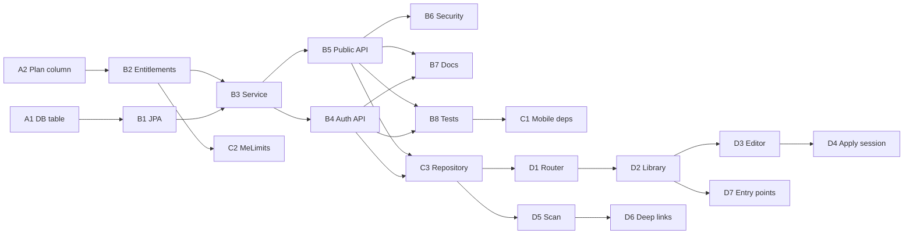

# Saved place lists, QR share, and in-app import — implementation steps

This document breaks the feature into **ordered implementation steps**. Follow **server before mobile** so the client can be developed against real endpoints.

**Related context:** [API_CONTRACT.md](./API_CONTRACT.md), [PLACE_NAMES.md](./PLACE_NAMES.md), existing place lists in `user_place_lists` (watch/broadcast only).

---

## Design summary (fixed for this plan)

| Decision | Choice |
|----------|--------|
| Stored shape | `display_names` + `normalized_names` JSON (same idea as `user_place_lists`) |
| Name rules | Same as **watch** list: validate + dedupe by normalized form (`PlaceListService.validateAndDedupe` semantics) so applying to broadcast never hits duplicate-name errors |
| Share key | Opaque URL-safe `share_token`, unique in DB |
| Public API | `GET /api/v1/public/saved-place-lists/{token}` — unauthenticated, returns display `names` + `title` |
| QR content (v1) | `woleh://saved-lists/{token}` |
| Who can use CRUD | Users with `woleh.place.watch` **or** `woleh.place.broadcast` |
| Max names per template | If user has `woleh.place.broadcast`: use `placeBroadcastMax`; else `placeWatchMax` |
| Max templates per user | New limit: `savedPlaceListMax` on plan + free-tier default in `EntitlementService` |

---

## Phase A — Database

### Step A1: Saved lists table

- Add Flyway migration **after** current latest (e.g. `V11__user_saved_place_lists.sql`).
- Create `user_saved_place_lists` with:
  - `id` (bigserial PK)
  - `user_id` (FK → `users`, `ON DELETE CASCADE`)
  - `title` (varchar, nullable or empty allowed)
  - `share_token` (varchar, **unique**, not null)
  - `display_names` / `normalized_names` (text, JSON arrays, defaults `[]`)
  - `created_at`, `updated_at` (timestamptz)
- Indexes: `user_id`; unique on `share_token`.

### Step A2: Plan limit column

- New migration (e.g. `V12__plans_saved_place_list_max.sql`): `ALTER TABLE plans ADD COLUMN saved_place_list_max INTEGER NOT NULL DEFAULT <n>;`
- Set sensible values per existing `plan_id` rows (free vs paid dev seeds in `V4__seed_plans.sql` if you rely on them).

**Checkpoint:** Flyway runs clean on empty and existing DBs.

---

## Phase B — Backend domain and API

### Step B1: JPA and repository

- Entity mirroring table (e.g. `UserSavedPlaceList` under `server/.../model/`).
- Repository with: `findByUser_IdOrderByUpdatedAtDesc`, `findByShareToken`, `countByUser_Id`, etc.

### Step B2: Entitlements and `GET /me`

- Extend [`Entitlements`](server/src/main/java/odm/clarity/woleh/subscription/Entitlements.java) with `savedPlaceListMax`.
- [`EntitlementService`](server/src/main/java/odm/clarity/woleh/subscription/EntitlementService.java): populate from `Plan` for subscribed users; set **free-tier default** in `freeTier()`.
- Update [`Plan`](server/src/main/java/odm/clarity/woleh/model/Plan.java) getter + constructor/factory as needed.
- Extend [`MeResponse.Limits`](server/src/main/java/odm/clarity/woleh/api/dto/MeResponse.java) and [`MeController.toMeResponse`](server/src/main/java/odm/clarity/woleh/api/MeController.java).

### Step B3: `SavedPlaceListService`

- **Create:** generate token (`SecureRandom` → base64url), validate/dedupe names via `PlaceNameNormalizer` + watch-style dedupe; enforce per-list name cap and `countByUser_Id < savedPlaceListMax`.
- **Read (owner):** return DTOs (id, title, names, shareToken, timestamps as needed).
- **Update:** replace title and/or names with same validation.
- **Delete:** by id and user ownership.
- **Public read by token:** return title + display names only; `404` if missing.
- **Do not** invoke `MatchingService`, `MatchAdjacencyRegistry`, or `WsSessionRegistry` — templates are not live lists.

### Step B4: Authenticated controller

- New controller under `/api/v1/me/saved-place-lists`:
  - `GET` — list summaries (lightweight: id, title, count, updatedAt, shareToken optional in list vs detail only — your choice).
  - `POST` — create body `{ "title"?: string, "names": string[] }`.
  - `GET /{id}` — full detail.
  - `PUT /{id}` — replace `{ "title"?: string, "names": string[] }`.
  - `DELETE /{id}`.
- Enforce: caller has watch **or** broadcast permission (same rule as map); otherwise `PERMISSION_DENIED`.
- Optional: rate-limit writes (pattern: [`PlaceListRateLimiter`](server/src/main/java/odm/clarity/woleh/ratelimit/PlaceListRateLimiter.java)).

### Step B5: Public controller

- `GET /api/v1/public/saved-place-lists/{token}` — `permitAll` in security config only for this **GET** path.
- Return `ApiEnvelope` with `{ "title", "names" }`.
- Optional: IP-based rate limit to reduce scraping.

### Step B6: Security

- [`SecurityConfig.java`](server/src/main/java/odm/clarity/woleh/config/SecurityConfig.java): add `requestMatchers(HttpMethod.GET, "/api/v1/public/saved-place-lists/**").permitAll()` (adjust pattern to match Spring conventions).

### Step B7: API contract and errors

- Update [`docs/API_CONTRACT.md`](docs/API_CONTRACT.md): new sections for saved lists + public GET; document codes (`NOT_FOUND`, `OVER_LIMIT`, `VALIDATION_ERROR`, `PERMISSION_DENIED`) consistent with existing patterns.
- Reuse existing exception types where possible (`PlaceLimitExceededException`, `PlaceNameValidationException`, etc.) or add narrow domain exceptions + handler entries.

### Step B8: Backend tests

- Integration tests: public GET happy path + unknown token; authenticated CRUD; create when at `savedPlaceListMax`; invalid names; wrong owner on `GET/PUT/DELETE` id.

**Checkpoint:** `./mvnw test` (or project equivalent) green; manual `curl` against local server.

---

## Phase C — Mobile foundation

### Step C1: Dependencies

- [`mobile/pubspec.yaml`](mobile/pubspec.yaml): add `qr_flutter`, `mobile_scanner`, `app_links` (or chosen equivalent).

### Step C2: `GET /me` and limits

- Extend [`MeLimits`](mobile/lib/features/me/data/me_dto.dart) with `savedPlaceListMax` (parse with fallback for older servers during rollout).
- Regenerate or hand-update any `MeLoadSnapshot` usage if needed.

### Step C3: API client for saved lists

- New repository (pattern: [`PlaceListRepository`](mobile/lib/features/places/data/place_list_repository.dart)):
  - Authenticated CRUD under `/me/saved-place-lists`.
  - **Public** `GET`: either a second `Dio` without auth interceptors or full URL from `API_BASE_URL` + `/api/v1/public/...` — avoid sending Bearer on public call.
- DTOs for list summary, detail, create/update request, public response.
- Map HTTP errors via existing [`AppError`](mobile/lib/core/app_error.dart) patterns.

### Step C4: Share URL helper

- Centralize: `shareUrlForToken(String token)` → `woleh://saved-lists/$token` (optional later: `String.fromEnvironment('SHARE_LINK_BASE', ...)`).

**Checkpoint:** Repository unit tests with mocked Dio (see [`place_list_repository_test.dart`](mobile/test/features/places/place_list_repository_test.dart)).

---

## Phase D — Mobile UI and navigation

### Step D1: Routing

- [`router.dart`](mobile/lib/app/router.dart): routes e.g. `/saved-lists`, `/saved-lists/new`, `/saved-lists/:id`, `/saved-lists/scan`.
- Add `_permissionGuardsAny` for these paths: require watch **or** broadcast (same as `/home`).
- Run `dart run build_runner build` for Riverpod codegen after new `@riverpod` providers.

### Step D2: Library screen

- List from `GET /me/saved-place-lists`; pull-to-refresh; empty state.
- Actions per row: open editor, delete (confirm), **Show QR** (dialog or route with `QrImageView` + copy link).
- FAB: create new list (empty editor).

### Step D3: Editor screen

- Add/remove/reorder (if reorder: match [`broadcast_screen.dart`](mobile/lib/features/places/presentation/broadcast_screen.dart) patterns).
- Client-side validation using [`place_name_normalizer.dart`](mobile/lib/core/place_name_normalizer.dart).
- Save → `PUT` or `POST`; show server validation errors.

### Step D4: Apply template to session

- Extract or duplicate **XOR** behavior from [`places_search_screen.dart`](mobile/lib/features/places/presentation/places_search_screen.dart): saving watch clears broadcast and vice versa when the user has both capabilities.
- After successful `putWatchList` / `putBroadcastList`: `invalidate` watch/broadcast notifiers; navigate to `/home` (or pop).
- Hide **Broadcast** if `woleh.place.broadcast` missing.

### Step D5: Scan flow

- Full-screen scanner (`mobile_scanner`).
- On valid QR / pasted link: parse token from `woleh://saved-lists/{token}` (tolerate minor format variants if needed).
- Fetch public DTO → preview bottom sheet or screen: show title + names; actions **Save copy** (POST), **Watch now**, **Broadcast now** (with permission checks).

### Step D6: Deep links

- `app_links`: listen for `woleh://saved-lists/...` when app is cold or warm started; navigate to import preview with token (reuse D5 logic).
- Ensure subscription `woleh://subscription/...` handling remains unaffected ([`checkout_webview_screen.dart`](mobile/lib/features/subscription/presentation/checkout_webview_screen.dart)).

### Step D7: Entry points

- [`profile_screen.dart`](mobile/lib/features/me/presentation/profile_screen.dart) and/or [`map_home_screen.dart`](mobile/lib/features/home/presentation/map_home_screen.dart): navigation to `/saved-lists`.

### Step D8: Analytics (optional)

- [`analytics.dart`](mobile/lib/core/analytics.dart) / [`ANALYTICS_EVENTS.md`](docs/ANALYTICS_EVENTS.md): e.g. `saved_list_created`, `saved_list_imported_scan`, `session_started_from_saved_list`.

**Checkpoint:** Manual test on device: create → QR → second device scan → copy → watch/broadcast; deep link from notes/email.

---

## Phase E — Polish and rollout

### Step E1: Offline behavior

- If no cache for saved lists API, show clear errors; optional small local cache later (not required for MVP).

### Step E2: Staging / env

- No new secrets; confirm CORS unchanged (public GET only).

### Step E3: Follow-ups (not MVP)

- HTTPS share links + Universal Links / App Links.
- Rotate `share_token` (“stop sharing”).
- Server-side “import by token” if you want audit trail of copies.

---

## Dependency graph (short)

---

## Suggested sprint breakdown

| Sprint | Scope |
|--------|--------|
| **1** | Phase A + Phase B (backend complete, tested) |
| **2** | Phase C + Phase D1–D4 (manage lists + QR display + apply to session) |
| **3** | Phase D5–D8 + Phase E (scan, deep links, entry points, analytics, staging smoke) |

---

## File touch list (expected)

| Area | Files / locations |
|------|-------------------|
| DB | `server/src/main/resources/db/migration/V11__*.sql`, `V12__*.sql` |
| Backend | `model/`, `repository/`, new `*Service`, `*Controller`, `SecurityConfig.java`, `EntitlementService.java`, `Entitlements.java`, `Plan.java`, `MeResponse.java`, `MeController.java` |
| Docs | `docs/API_CONTRACT.md`, this file |
| Mobile | `pubspec.yaml`, `me_dto.dart`, new `features/saved_lists/` (or under `places/`), `router.dart`, `profile_screen.dart` / `map_home_screen.dart` |

When a step is done, mark it in your tracker or append a short “Implemented in commit …” line under that step in this doc if you want a living log.
